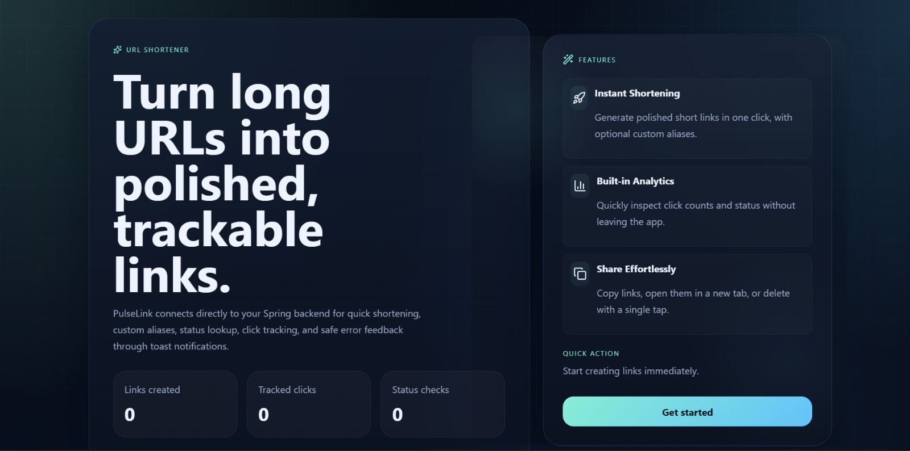
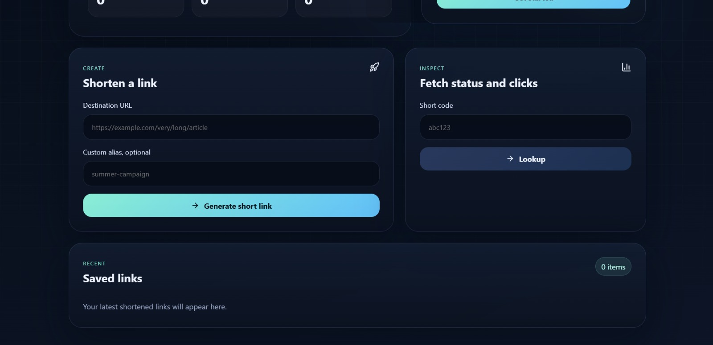

# 🔗 PulseLink — URL Shortener

> Turn long URLs into polished, trackable links.

A scalable, production-oriented **URL Shortener service** built with **Spring Boot**, **Redis**, and **MySQL**. PulseLink features Base62 short link generation, custom aliases, real-time click tracking, Redis-based caching for fast redirects, and rate limiting to prevent abuse.



---

## 📌 Table of Contents

- [Features](#features)
- [Screenshots](#screenshots)
- [Architecture](#architecture)
- [Tech Stack](#tech-stack)
- [API Endpoints](#api-endpoints)
- [Performance Optimizations](#performance-optimizations)
- [Rate Limiting](#rate-limiting)
- [Getting Started](#getting-started)

---

## ✨ Features

- 🔗 **Instant Shortening** — Generate polished short links in one click, with optional custom aliases
- 📊 **Built-in Analytics** — Quickly inspect click counts and status without leaving the app
- 🗑️ **Share Effortlessly** — Copy links, open in a new tab, or delete with a single tap
- ⚡ **Fast Redirects** — Redis cache-aside pattern eliminates redundant database calls
- 🚫 **Rate Limiting** — Redis fixed-window strategy restricts to 100 requests per 60 seconds
- 📈 **Optimized Click Tracking** — Atomic Redis counters with scheduled batch writes to MySQL

---

## 📸 Screenshots

### Home — Link Dashboard


### Create & Inspect


---

## 🏗️ Architecture

```
Client Request
      ↓
Rate Limiter (Redis — fixed window per IP)
      ↓
Cache Check (Redis — cache-aside)
      ↓          ↘ Cache Hit → return original URL instantly
Database (MySQL)
      ↓
Scheduled Job → Batch update click counts to MySQL
```

---

## 🛠️ Tech Stack

| Layer | Technology |
|---|---|
| Backend | Spring Boot |
| Cache | Redis |
| Database | MySQL |
| Frontend | React (PulseLink UI) |
| Build Tool | Maven |
| Infrastructure | Docker (Redis) |

---

## 📡 API Endpoints

| Method | Endpoint | Description |
|---|---|---|
| `POST` | `/api/url` | Create a short URL (with optional custom alias) |
| `GET` | `/api/url/{shortUrl}` | Redirect to the original URL |
| `GET` | `/api/url/status/{shortUrl}` | Fetch click count and URL status |
| `DELETE` | `/api/url/{shortUrl}` | Delete a short URL and invalidate cache |

---

## ⚡ Performance Optimizations

- 🚀 **Zero DB calls on redirect** — original URL served directly from Redis cache
- 📉 **Reduced DB writes** — click counts batched via scheduled job instead of per-request writes
- ⚡ **Atomic operations** — Redis `INCR` and `GETDEL` for thread-safe counters
- 🧹 **Cache invalidation** — on deletion, 3 cache keys (`url`, `status`, `click`) are removed to ensure consistency between Redis and MySQL

---

## 🚫 Rate Limiting

Implemented using a **Redis fixed-window strategy**:

- **Key format:** `rate:<ip+shortUrl>`
- **Limit:** 100 requests per 60-second window
- **Configurable** via `application.yml`:

```yaml
rate-limit:
  requests: 10
  duration: 30
```

---

## ▶️ Getting Started

### Prerequisites

- Java 17+
- Docker
- Maven

### 1. Clone the Repository

```bash
git clone https://github.com/anup-08/URL-Shortener.git
cd URL-Shortener
```

### 2. Run Redis via Docker

```bash
docker run -d -p 6379:6379 redis
```

### 3. Set Environment Variables

```bash
db_url=jdbc:mysql://localhost:3306/urlshortener
db_user=root
db_password=your_password
redis_host=localhost
redis_port=6379
```

### 4. Run the Backend

```bash
cd backend
mvn spring-boot:run
```

### 5. Run the Frontend

```bash
cd frontend
npm install
npm start
```

Frontend runs at `http://localhost:3000`, backend at `http://localhost:8080`.

---
